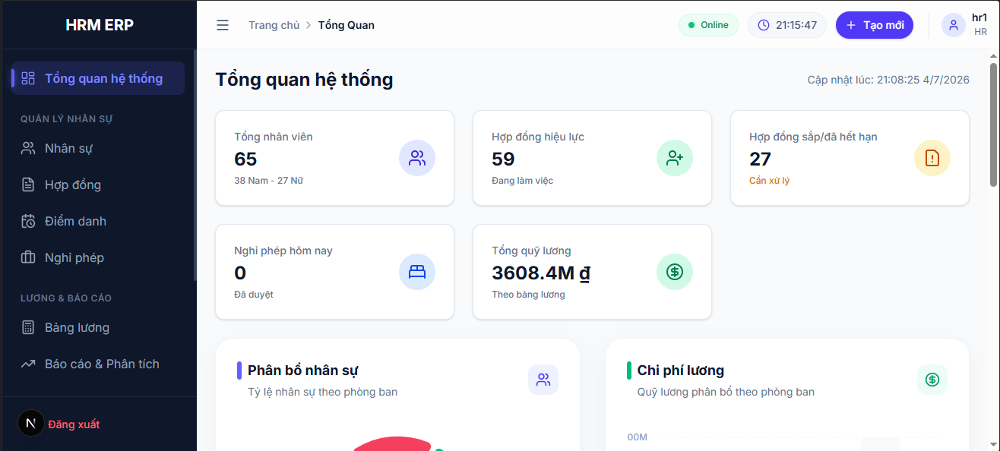
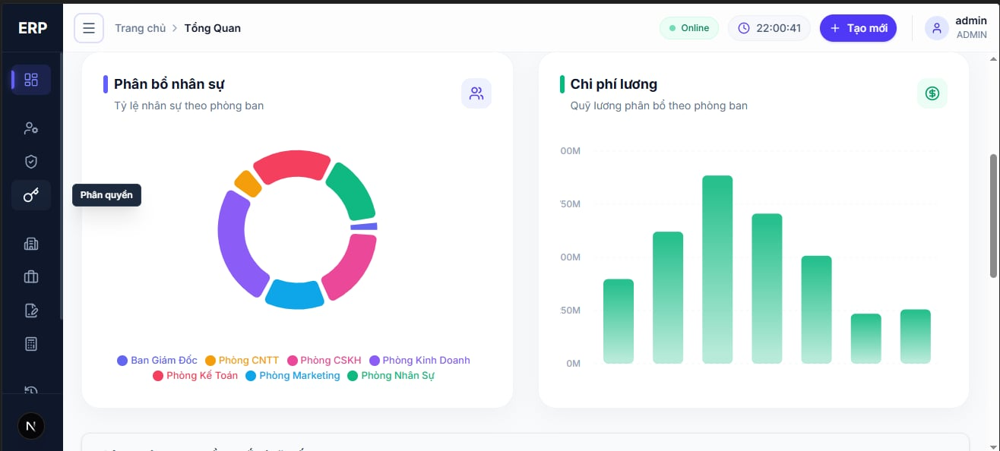

# HRPayrollSystem — Hệ Thống Quản Lý Nhân Sự & Tính Lương Tự Động

[](https://dev.mysql.com/doc/)
[](https://dev.mysql.com/doc/refman/8.0/en/innodb-storage-engine.html)
[](https://dev.mysql.com/doc/refman/8.0/en/charset-unicode.html)
[](LICENSE)
[]()
[]()

> **Đồ án môn Hệ Quản Trị Cơ Sở Dữ Liệu**
> Xây dựng hệ thống backend hoàn chỉnh cho bài toán quản lý nhân sự và tính lương tự động tại doanh nghiệp vừa và nhỏ (50–500 nhân viên), triển khai toàn bộ trên **MySQL 8.0+** với kiến trúc database-centric: stored procedures, triggers, functions, views và index đa lớp.

---

## Tổng Quan Kiến Trúc

Hệ thống được thiết kế theo mô hình **Database-Centric Architecture**, đẩy toàn bộ business logic xuống tầng database thay vì xử lý ở application layer. Điều này đảm bảo tính toàn vẹn dữ liệu, khả năng audit đầy đủ và hiệu năng xử lý tối ưu ngay tại nguồn dữ liệu.

```
┌─────────────────────────────────────────────────────────────────┐
│                     CLIENT LAYER                                │
│       (Next.js Dashboard / React / TailwindCSS / Web App)       │
└────────────────────────┬────────────────────────────────────────┘
                         │  CALL / SELECT / INSERT
┌────────────────────────▼────────────────────────────────────────┐
│                  STORED PROCEDURE LAYER                         │
│   sp_TinhLuong  │  sp_ChamCong  │  sp_TaoBangLuong             │
│   sp_BaoCaoNhanSu  │  sp_XacNhanBangLuong  │  sp_ThanhToanLuong │
└────────────────────────┬────────────────────────────────────────┘
                         │  gọi hàm / truy vấn bảng
┌────────────────────────▼────────────────────────────────────────┐
│                   FUNCTION LAYER                                │
│   fn_TinhThueTNCN_Scalar  │  fn_TinhBH_NLD  │  fn_TinhBH_NSDLD │
│   fn_SoNgayChuanThang     │  fn_HeSoLuongThang  │  ...          │
└────────────────────────┬────────────────────────────────────────┘
                         │  DML trên bảng → kích hoạt
┌────────────────────────▼────────────────────────────────────────┐
│                   DATA LAYER (17 Tables — InnoDB)               │
│  NhanVien │ HopDong │ LuongCoBan │ ChamCong │ BangLuong         │
│  ChiTietLuong │ KhauTru │ AuditLog_HopDong │ AuditLog_Luong     │
│  PhongBan │ ChucVu │ LoaiHopDong │ NghiPhep │ NhanVienPhucLoi   │
│  LoaiNghiPhep │ LoaiPhucLoi │ NgayLe                           │
└────────────────────────┬────────────────────────────────────────┘
                         │  INSERT/UPDATE/DELETE → tự động kích hoạt
┌────────────────────────▼────────────────────────────────────────┐
│                   TRIGGER LAYER (21 Triggers)                   │
│  Audit Trail  │  Data Validation  │  Business Rule Enforcement  │
└─────────────────────────────────────────────────────────────────┘
```

---

## Tính Năng Nổi Bật

### Tính Lương Tự Động (sp_TinhLuong)

Stored procedure cốt lõi xử lý toàn bộ pipeline tính lương trong **1 lệnh duy nhất**:

```sql
CALL sp_TinhLuong(3, 2025, NULL, 0, 0);
-- Tháng 3/2025 | Toàn bộ NV | Không override | Không dry-run
```

Pipeline 8 bước nội bộ: Xác thực đầu vào → Lấy danh sách NV → Tính ngày công → Tính lương gross → Tính BHXH/BHYT/BHTN → Tính thuế TNCN → Ghi ChiTietLuong → Tổng kết & báo cáo. Tất cả trong 1 transaction ACID.

### Thuế TNCN Luỹ Tiến 7 Bậc (fn_TinhThueTNCN_Scalar)

Triển khai đúng theo **Thông tư 111/2015/TT-BTC**:

| Bậc | Thu nhập tính thuế/tháng | Thuế suất |
| ---- | ---------------------------- | ----------- |
| 1    | ≤ 5,000,000 VND             | 5%          |
| 2    | 5,000,001 – 10,000,000 VND  | 10%         |
| 3    | 10,000,001 – 18,000,000 VND | 15%         |
| 4    | 18,000,001 – 32,000,000 VND | 20%         |
| 5    | 32,000,001 – 52,000,000 VND | 25%         |
| 6    | 52,000,001 – 80,000,000 VND | 30%         |
| 7    | > 80,000,000 VND             | 35%         |

Giảm trừ: Bản thân **11,000,000 VND/tháng** | Phụ thuộc **4,400,000 VND/người/tháng**

### Audit Trail Tự Động (Triggers)

Mọi thay đổi hợp đồng và lương đều được ghi log tự động với đầy đủ: `old_value`, `new_value`, `changed_by`, `changed_at`, `ip_address`. Bảng lương đã **CHỐT** không thể sửa hoặc xóa — enforced tại tầng trigger, không phụ thuộc application.

### Công Thức Tính Lương

```
Lương Gross  = LuongCoBan × HeSoChucVu × (NgayDiLam / NgayChuanThang)
             + (Tổng Phụ Cấp × (NgayDiLam / NgayChuanThang))
             + Lương Làm Thêm Giờ

* Quy tắc 14 ngày: Nếu số ngày nghỉ không lương ≥ 14 ngày/tháng → Miễn đóng BH.
Lương đóng BH = min(LuongCoBan, 20 × LuongToiThieuVung) (nếu phải đóng)
BHXH NLĐ = LuongDongBH × 8%  │  BHYT NLĐ = × 1.5%  │  BHTN NLĐ = × 1%
Tổng BH NLĐ = 10.5%

TNCT = Gross − BH_NLĐ − GiamTruBanThan − GiamTruPhuThuoc
ThuếTNCN = fn_TinhThueTNCN_Scalar(TNCT)

Lương Net = Gross − BH_NLĐ − ThuếTNCN − KhauTruKhac
```

---

## Giao Diện Ứng Dụng (Dashboard)





---

## Thống Kê Dự Án

| Hạng mục                  | Số lượng | Chi tiết                                               |
| --------------------------- | ----------- | ------------------------------------------------------- |
| **Tables**            | 18          | InnoDB, utf8mb4_unicode_ci                              |
| **Stored Procedures** | 27          | Tính lương, chấm công, báo cáo, bảng lương    |
| **Functions**         | 13          | Thuế TNCN, BHXH, ngày công, hệ số lương          |
| **Triggers**          | 23          | Audit trail, validate, business rules                   |
| **Views**             | 7           | Bảng lương, chấm công, thuế, tỷ lệ chuyên cần |
| **Indexes**           | 20+         | Composite index cho tính lương, báo cáo            |
| **Dữ liệu mẫu**    | 50 NV       | 3 tháng chấm công (≥3,000 records)                  |
| **Test cases**        | 177         | 102 lương + 75 chấm công                            |
| **Tổng dòng SQL**   | ~11,316     | Bao gồm testcases                                      |
| **DBMS**              | MySQL 8.0+  | Engine: InnoDB                                          |

---

## Cấu Trúc Dự Án

```
DBMS_Final_HRM/
├── 01_Analysis/
│   ├── ERD_diagram.drawio          # Sơ đồ ERD — draw.io
│   └── requirements.md             # Đặc tả yêu cầu nghiệp vụ
│
├── 02_Database/
│   ├── DDL/
│   │   ├── 01_create_tables.sql    # 18 bảng, constraints, tiering
│   │   ├── 02_constraints.sql      # CHECK constraints, unique index
│   │   ├── 03_indexes.sql          # 20+ composite index
│   │   └── 04_perf_indexes.sql     # Index tối ưu hiệu năng cho UI
│   ├── Functions/                  # 12 scalar functions
│   │   ├── fn_TinhThueTNCN.sql     # Thuế TNCN (3 functions)
│   │   ├── fn_TinhBHXH.sql         # BHXH/BHYT/BHTN (4 functions)
│   │   └── fn_SoNgayLamViec.sql    # Ngày công (5 functions)
    ├── Triggers/                   # 21 triggers
    │   ├── trg_LogHopDong.sql      # Audit hợp đồng (6 triggers)
    │   ├── trg_NhanVien_CheckTuoi.sql # Check tuổi (2 triggers)
    │   ├── trg_LogLuong.sql        # Audit lương + bảo vệ (5 triggers)
    │   ├── trg_LuongCoBan_CheckOneCurrent.sql # Check lương duy nhất (2 triggers)
    │   ├── trg_KhauTru_Validate.sql # Check khấu trừ (2 triggers)
    │   ├── trg_NghiPhep_CheckOverlap.sql # Check trùng nghỉ phép (2 triggers)
    │   └── trg_KiemTraChamCong.sql # Validate chấm công (2 triggers)
│   ├── StoredProcedures/           # 21 stored procedures
│   │   ├── sp_TinhLuong.sql        # Cốt lõi: pipeline tính lương
│   │   ├── sp_ChamCong.sql         # Vòng đời chấm công (6 SPs)
│   │   ├── sp_TaoBangLuong.sql     # Bảng lương chính thức (6+2 SPs)
│   │   └── sp_BaoCaoNhanSu.sql     # Báo cáo nhân sự (6 SPs)
│   ├── Views/                      # 6 views
│   │   ├── vw_BangLuong.sql        # Chi tiết, tổng hợp, quyết toán thuế
│   │   └── vw_TongHopChamCong.sql  # Tổng hợp, chi tiết, tỷ lệ chuyên cần
│   └── DML/
│       ├── seed_data.sql           # 50 NV thực tế + 3 tháng chấm công
│       └── test_queries.sql        # 71 integration queries
│
├── 03_App/
│   ├── frontend/                   # Ứng dụng Next.js (React, TailwindCSS, TypeScript)
│   │   ├── src/app/(dashboard)/    # Giao diện quản lý: Bảng lương, Lịch sử, Báo cáo
│   │   └── src/components/         # Các thành phần UI có thể tái sử dụng
│   └── backend/                    # API Server xử lý Database Layer
│
├── 04_Testing/
│   ├── testcase_luong.sql          # 102 test cases — module lương
│   └── testcase_chamcong.sql       # 75 test cases — module chấm công
│
├── 05_Docs/
│   ├── BaoCaoDoAn.docx             # Báo cáo đồ án
│   └── Slides_BaoCao.pptx          # Slide thuyết trình
│
├── HUONG_DAN_CHAY_DU_AN.md        # Hướng dẫn chạy chi tiết
└── README.md                       # File này
```

---

## Yêu Cầu Hệ Thống

```
MySQL Server   ≥ 8.0   (bắt buộc — hỗ trợ CHECK constraints, Window Functions)
Quyền          ALL PRIVILEGES hoặc SUPER + CREATE ROUTINE + TRIGGER
Character Set  utf8mb4 + utf8mb4_unicode_ci
```

**Công cụ khuyến nghị:** MySQL Workbench 8.0 · DBeaver · HeidiSQL · DataGrip

---

## Khởi Động Nhanh

```sql
-- Bước 0: Cài biến global (1 lần duy nhất)
SET GLOBAL log_bin_trust_function_creators = 1;

-- Bước 1–3: DDL
SOURCE 02_Database/DDL/01_create_tables.sql;
SOURCE 02_Database/DDL/02_constraints.sql;
SOURCE 02_Database/DDL/03_indexes.sql;
SOURCE 02_Database/DDL/04_perf_indexes.sql;

-- Bước 4: Functions
SOURCE 02_Database/Functions/fn_TinhThueTNCN.sql;
SOURCE 02_Database/Functions/fn_TinhBHXH.sql;
SOURCE 02_Database/Functions/fn_SoNgayLamViec.sql;

-- Bước 5: Triggers
SOURCE 02_Database/Triggers/trg_LogHopDong.sql;
SOURCE 02_Database/Triggers/trg_LogLuong.sql;
SOURCE 02_Database/Triggers/trg_KiemTraChamCong.sql;

-- Bước 6: Stored Procedures
SOURCE 02_Database/StoredProcedures/sp_TinhLuong.sql;
SOURCE 02_Database/StoredProcedures/sp_ChamCong.sql;
SOURCE 02_Database/StoredProcedures/sp_TaoBangLuong.sql;
SOURCE 02_Database/StoredProcedures/sp_BaoCaoNhanSu.sql;

-- Bước 7: Views
SOURCE 02_Database/Views/vw_BangLuong.sql;
SOURCE 02_Database/Views/vw_TongHopChamCong.sql;

-- Bước 8: Seed data
SOURCE 02_Database/DML/seed_data.sql;

-- Bước 9: Chạy tính lương 3 tháng năm 2026
CALL sp_TinhLuong(3, 2026, NULL, 0, 0);
CALL sp_TinhLuong(4, 2026, NULL, 0, 0);
CALL sp_TinhLuong(5, 2026, NULL, 0, 0);
```

> Xem chi tiết từng bước, xử lý lỗi và checklist hoàn thành tại [HUONG_DAN_CHAY_DU_AN.md](HUONG_DAN_CHAY_DU_AN.md)

---

## Danh Sách Đối Tượng Database

### Stored Procedures (27)

| Nhóm                   | Procedure                         | Mô tả                                                   |
| ----------------------- | --------------------------------- | --------------------------------------------------------- |
| **Lương**       | `sp_TinhLuong`                  | Pipeline tính lương tự động — cốt lõi hệ thống |
|                         | `sp_TinhBHXH_ChiTiet`           | Tính chi tiết BHXH cho từng nhân viên                |
|                         | `sp_TinhThueTNCN_ChiTiet`       | Tính chi tiết thuế TNCN cho từng nhân viên           |
|                         | `sp_XacNhanBangLuong`           | Chuyển trạng thái Draft → Confirmed                   |
|                         | `sp_ThanhToanLuong`             | Đánh dấu Confirmed → Paid                             |
|                         | `sp_ChotBangLuong`              | Chốt bảng lương cuối kỳ, không cho sửa đổi           |
| **Bảng lương** | `sp_TaoBangLuong_ChinhThuc`     | Bảng lương tổng hợp chính thức                     |
|                         | `sp_TaoBangLuong_PhieuLuong`    | Phiếu lương chi tiết 1 nhân viên                    |
|                         | `sp_TaoBangLuong_BHXH`          | Danh sách đóng BHXH tháng                             |
|                         | `sp_TaoBangLuong_QuyetToanThue` | Dữ liệu quyết toán thuế TNCN                         |
|                         | `sp_TaoBangLuong_SoSanh`        | So sánh quỹ lương nhiều kỳ                          |
|                         | `sp_TaoBangLuong_ChiPhiNhanSu`  | Chi phí nhân sự toàn DN                               |
| **Chấm công**   | `sp_ChamCong_NhapHangNgay`      | UPSERT chấm công 1 NV 1 ngày                           |
|                         | `sp_ChamCong_NhapLoat`          | Nhập hàng loạt từ bảng tạm                          |
|                         | `sp_ChamCong_CapNhat`           | Sửa trạng thái / giờ giấc                            |
|                         | `sp_ChamCong_DongBoNghiPhep`    | Đồng bộ đơn đã duyệt → CC                        |
|                         | `sp_NghiPhep_PheDuyet`          | Duyệt / từ chối đơn nghỉ                            |
|                         | `sp_ChamCong_BaoCaoThang`       | Báo cáo tổng hợp kỳ lương                          |
| **Báo cáo**     | `sp_BaoCaoNhanSu_TongQuan`      | Dashboard nhân sự tổng hợp                            |
|                         | `sp_BaoCaoNhanSu_TheoPhongBan`  | Phân tích cơ cấu theo PB/CV                           |
|                         | `sp_BaoCaoNhanSu_HopDong`       | Trạng thái & sắp hết hạn HĐ                         |
|                         | `sp_BaoCaoNhanSu_BienDong`      | Tuyển mới / nghỉ việc theo kỳ                        |
|                         | `sp_BaoCaoNhanSu_LuongPhanPhoi` | Phân phối lương & xếp hạng                          |
|                         | `sp_BaoCaoNhanSu_NghiPhepNam`   | Quản lý phép năm tồn dư                             |
| **Nhân sự**     | `sp_TiepNhanNhanSu`             | Quy trình tiếp nhận nhân viên mới                     |
|                         | `sp_DieuChuyenThangChuc`        | Điều chuyển phòng ban, thăng chức nhân viên       |
|                         | `sp_NghiViec`                   | Xử lý quy trình nghỉ việc, bàn giao                   |

### Functions (13)

| Nhóm                 | Function                    | Trả về                                   |
| --------------------- | --------------------------- | ------------------------------------------ |
| **Thuế TNCN**  | `fn_TinhThueTNCN_Scalar`  | Tiền thuế TNCN (DECIMAL)                 |
|                       | `fn_XacDinhBacThue`       | Bậc thuế 1–7 (TINYINT)                  |
|                       | `fn_TinhGiamTruPhuThuoc`  | Tổng giảm trừ phụ thuộc (DECIMAL)     |
| **BHXH**        | `fn_TinhLuongDongBH`      | Lương đóng BH (có trần)              |
|                       | `fn_TinhBH_NLD`           | Tổng BH người lao động (10.5%)        |
|                       | `fn_TinhBH_NSDLD`         | Tổng BH chủ sử dụng lao động         |
|                       | `fn_TinhLuongLamThem`     | Lương OT theo hệ số ngày              |
| **Ngày công** | `fn_SoNgayChuanThang`     | Số ngày làm việc chuẩn trong tháng   |
|                       | `fn_SoNgayChamCong`       | Số ngày thực tế có mặt               |
|                       | `fn_SoNgayNghiCoLuong`    | Ngày nghỉ có hưởng lương            |
|                       | `fn_SoNgayNghiKhongLuong` | Ngày nghỉ không lương                 |
|                       | `fn_HeSoLuongThang`       | Hệ số lương theo ngày công thực tế |
| **Nhân sự**     | `fn_TinhThamNien`         | Tính thâm niên công tác (tháng/năm)      |

### Triggers (23)

| Bảng          | Trigger                        | Thời điểm  | Mục đích                             |
| -------------- | ------------------------------ | ------------- | --------------------------------------- |
| `ChamCong`   | `trg_ChamCong_BeforeInsert`  | BEFORE INSERT | Validate ngày không trong tương lai |
|                | `trg_ChamCong_BeforeUpdate`  | BEFORE UPDATE | Validate cập nhật chấm công         |
| `HopDong`    | `trg_HopDong_AfterInsert`    | AFTER INSERT  | Audit log hợp đồng mới              |
|                | `trg_HopDong_AfterUpdate`    | AFTER UPDATE  | Audit log thay đổi hợp đồng        |
|                | `trg_HopDong_AfterDelete`    | AFTER DELETE  | Audit log hủy hợp đồng              |
|                | `trg_HopDong_BeforeUpdate`   | BEFORE UPDATE | Enforce business rules HĐ              |
|                | `trg_HopDong_BeforeDelete`   | BEFORE DELETE | Ngăn xóa HĐ đang hiệu lực         |
|                | `trg_HopDong_CheckOneActive` | BEFORE INSERT | Đảm bảo 1 HĐ active/thời điểm    |
| `LuongCoBan` | `trg_LuongCoBan_AfterInsert` | AFTER INSERT  | Log điều chỉnh lương mới          |
|                | `trg_LuongCoBan_AfterUpdate` | AFTER UPDATE  | Log từng cột thay đổi               |
|                | `trg_LuongCoBan_CheckOneCurrent` | BEFORE INSERT | Đảm bảo chỉ 1 mức lương đang áp dụng |
|                | `trg_LuongCoBan_CheckOneCurrent_Update` | BEFORE UPDATE | Ngăn chuyển 2 mức lương sang áp dụng |
| `NghiPhep`   | `trg_NghiPhep_CheckOverlap_Insert` | BEFORE INSERT | Chặn trùng lịch nghỉ đã duyệt      |
|                | `trg_NghiPhep_CheckOverlap_Update` | BEFORE UPDATE | Chặn trùng lịch nghỉ khi sửa ngày  |
| `KhauTru`    | `trg_KhauTru_BeforeInsert_NgayHopLe` | BEFORE INSERT | Chặn ngày khấu trừ tương lai        |
|                | `trg_KhauTru_BeforeUpdate_NgayHopLe` | BEFORE UPDATE | Chặn ngày khấu trừ tương lai        |
| `BangLuong`  | `trg_BangLuong_BeforeUpdate` | BEFORE UPDATE | Ngăn sửa bảng lương CHỐT          |
|                | `trg_BangLuong_BeforeDelete` | BEFORE DELETE | Ngăn xóa bảng lương CHỐT          |
|                | `trg_BangLuong_AfterUpdate`  | AFTER UPDATE  | Log chuyển trạng thái                |
|                | `trg_BangLuong_BeforeUpdate_Protect` | BEFORE UPDATE | Bảo vệ bảng lương đã chốt           |
|                | `trg_BangLuong_BeforeDelete_Protect` | BEFORE DELETE | Bảo vệ dữ liệu bảng lương           |

### Views (7)

| View                        | Mô tả                                                  |
| --------------------------- | -------------------------------------------------------- |
| `vw_BangLuong`            | Chi tiết lương đầy đủ từng nhân viên từng kỳ |
| `vw_BangLuong_TongHop`    | Tổng hợp quỹ lương theo phòng ban/tháng           |
| `vw_HoSoNhanVien_ChiTiet` | Hồ sơ chi tiết nhân viên (chức vụ, phòng ban) |
| `vw_ThueTNCN_KyQuyetToan` | Dữ liệu quyết toán thuế TNCN theo nhân viên       |
| `vw_TongHopChamCong`      | Tổng hợp chấm công theo nhân viên/tháng           |
| `vw_ChamCong_ChiTiet`     | Chi tiết chấm công từng ngày                        |
| `vw_TyLeChuyenCan`        | Tỷ lệ chuyên cần và phân loại nhân viên         |

---

## Quy Tắc Nghiệp Vụ Cốt Lõi

| Mã   | Quy tắc                                                      | Thực thi tại                                 |
| ----- | ------------------------------------------------------------- | ---------------------------------------------- |
| BR-01 | Mã NV duy nhất, định dạng `NV######`                   | UNIQUE KEY + CHECK REGEXP                      |
| BR-02 | 1 NV chỉ có 1 hợp đồng đang hiệu lực                  | `trg_HopDong_CheckOneActive`                 |
| BR-03 | HĐ thử việc: lương 85%, không tính BHXH                | `fn_TinhBH_NLD` logic                        |
| BR-04 | Không chấm công ngày tương lai                          | `trg_ChamCong_BeforeInsert`                  |
| BR-05 | Bảng lương CHỐT không được sửa/xóa                  | `trg_BangLuong_Before*`                      |
| BR-06 | Lương OT: 170% ngày thường / 200% cuối tuần / 300% lễ | `fn_TinhLuongLamThem`                        |
| BR-07 | Trần lương đóng BH = 20× lương tối thiểu vùng      | `fn_TinhLuongDongBH`                         |
| BR-08 | 100% thay đổi lương & HĐ phải ghi audit log             | Trigger AFTER INSERT/UPDATE                    |
| BR-09 | Quy trình lương: Draft → Confirmed → Paid                | `sp_XacNhanBangLuong`, `sp_ThanhToanLuong` |

---

## Thiết Kế Phân Tầng Bảng

```
Tier 0 — Danh mục độc lập (Lookup / Master Data)
  PhongBan · ChucVu · LoaiHopDong · LoaiNghiPhep · LoaiPhucLoi · NgayLe

Tier 1 — Phụ thuộc Tier 0
  NhanVien

Tier 2 — Phụ thuộc Tier 1
  HopDong · LuongCoBan · NghiPhep · NhanVienPhucLoi

Tier 3 — Phụ thuộc Tier 1
  ChamCong

Tier 4 — Tính toán (kết quả sp_TinhLuong)
  BangLuong → ChiTietLuong · KhauTru

Tier 5 — Audit (ghi bởi Triggers)
  AuditLog_HopDong · AuditLog_Luong
```

---

## Công Nghệ & Tuân Thủ Pháp Lý

| Hạng mục            | Chi tiết                                                                |
| --------------------- | ------------------------------------------------------------------------ |
| **DBMS**        | MySQL 8.0+ — InnoDB engine, ACID transactions                           |
| **Charset**     | `utf8mb4` / `utf8mb4_unicode_ci` — hỗ trợ tiếng Việt đầy đủ |
| **Thuế TNCN**  | Thông tư 111/2015/TT-BTC — luỹ tiến 7 bậc                          |
| **Bảo hiểm**  | BHXH 8% + BHYT 1.5% + BHTN 1% (NLĐ); trần 20× lương tối thiểu     |
| **Hợp đồng** | Bộ Luật Lao Động 2019 — 4 loại HĐ                                 |
| **Phép năm**  | Tối thiểu 12 ngày/năm theo BLLĐ 2019                                |

---

## Liên Hệ & Đóng Góp

Đây là đồ án môn học. Mọi ý kiến đóng góp về thiết kế database, tối ưu query, hoặc bổ sung tính năng vui lòng mở **Issue** hoặc **Pull Request** trên repository.

---

*Cập nhật lần cuối: 21/06/2026 — DBMS: MySQL 8.0+ — Tích hợp Frontend Next.js*
